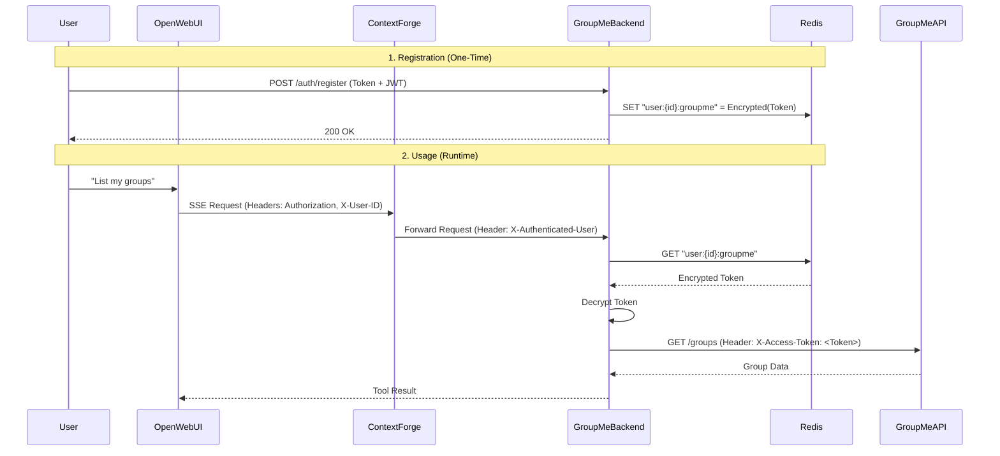

# Per-User Authentication Workflow

This document explains how **Context Forge** and the **GroupMe Backend** work together to provide secure, per-user authentication.

## 🔒 Security Architecture

Unlike simple API wrapping, this setup ensures that **user tokens are never exposed** to the LLM or client context after registration.



## 🔑 Key Concepts

1.  **Identity Propagation**: OpenWebUI authenticates the user. Context Forge trusts this identity and forwards it as the `X-Authenticated-User` header.
2.  **Secure Storage**: GroupMe Access Tokens are stored in **Redis** (internal to the cluster), encrypted at rest.
3.  **No Leaks**: The LLM never sees the raw Access Token, only the tool outputs.

## 🛠️ User Setup Guide

For a user to enable GroupMe tools, they must perform this one-time registration:

1.  **Get GroupMe Token**: Log in to [dev.groupme.com](https://dev.groupme.com) and copy your Access Token.
2.  **Register Token**:
    Run this command from your terminal (or use a helper tool if configured):

    ```bash
    # Replace keys and token with your actual values
    curl -X POST http://groupme-backend.apps.svc.cluster.local:5000/auth/register \
      -H "Authorization: Bearer <YOUR_OPENWEBUI_JWT>" \
      -H "Content-Type: application/json" \
      -d '{"groupme_token": "YOUR_GROUPME_ACCESS_TOKEN"}'
    ```

3.  **Verify**: The backend will return `{"status": "registered"}`.

## ⚙️ Configuration Verification

Ensure your **Context Forge** deployment has header passthrough enabled:

```yaml
# apps/base/mcp-servers/context-forge.yaml
env:
  - name: ENABLE_HEADER_PASSTHROUGH
    value: "true"
  - name: DEFAULT_PASSTHROUGH_HEADERS
    value: '["X-Authenticated-User", "Authorization"]'
```
