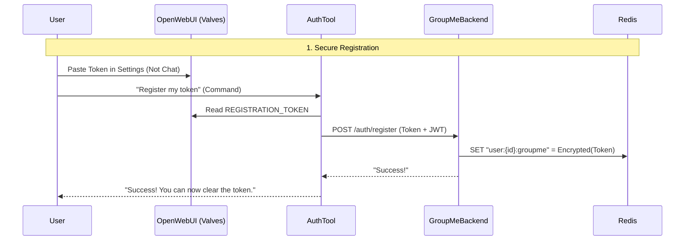

# Per-User Authentication Workflow

This document explains how **Context Forge** and the **GroupMe Backend** work together to provide secure, per-user authentication.

## 🔒 Security Architecture

Unlike simple API wrapping, this setup ensures that **user tokens are never exposed** to the LLM or client context after registration.



## 🔐 User Setup Guide

### Step 1: Get Your Token
1.  Log in to [dev.groupme.com](https://dev.groupme.com).
2.  Click **Access Token** in the top right.
3.  Copy your access token.

### Step 2: Securely Save Token
1.  In Open WebUI, go to **Workspace > Tools**.
2.  Find **Auth Registration** and click the **Gear Icon** (User Settings).
3.  Paste your token into the **REGISTRATION_TOKEN** field.
4.  Click **Save**.

### Step 3: Register
1.  In a chat, simply type:
    
    > Register Token

2.  The AI will confirm: *"✅ Success! Your GroupMe token has been securely registered."*

3.  (Optional) You can now go back to **Step 2** and clear the token field for extra security.

---

## 🛠️ Verification

Ensure your **Context Forge** deployment has header passthrough enabled:

```yaml
# apps/base/mcp-servers/context-forge.yaml
env:
  - name: ENABLE_HEADER_PASSTHROUGH
    value: "true"
  - name: DEFAULT_PASSTHROUGH_HEADERS
    value: '["X-Authenticated-User", "Authorization"]'
```
