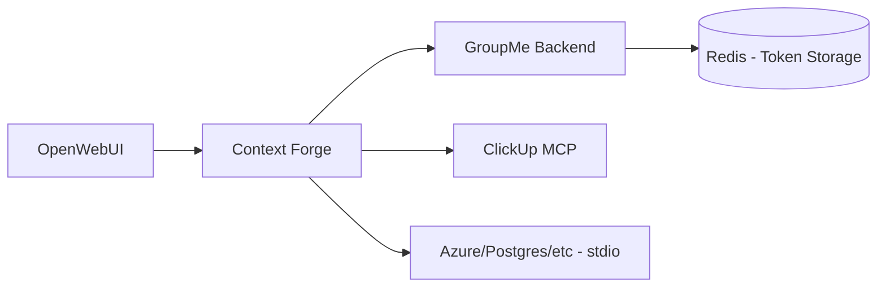

# MCP Servers

Model Context Protocol (MCP) tools for OpenWebUI integration via **Context Forge**.

## Overview

| Component | Description | Port | Ingress Host |
|-----------|-------------|------|--------------|
| **Context Forge** | MCP Gateway with per-user auth | 4444 | `mcp.k8s.local` |
| **GroupMe Backend** | GroupMe MCP server (Go) | 5000 | Internal only |
| **ClickUp MCP** | ClickUp MCP server | 5000 | Internal only |

## Architecture



## MCP Servers

### SSE Servers (Backend Services)

| Server | Internal URL | Per-User Auth |
|--------|--------------|---------------|
| **GroupMe** | `http://groupme-backend.apps.svc.cluster.local:5000/sse` | ✅ via `X-Authenticated-User` |
| **ClickUp Native** | `http://clickup-mcp-server.apps.svc.cluster.local:5000/sse` | ❌ |
| **n8n** | `http://n8n.apps.svc.cluster.local:5678/mcp-server/http` | ❌ (uses N8N_MCP_TOKEN) |

### stdio Servers (Spawned by Context Forge)

| Server | Package | Description |
|--------|---------|-------------|
| **Azure** | `@azure/mcp@latest` | Azure resource management |
| **Postgres** | `@henkey/postgres-mcp-server` | Database inspection |
| **Kubernetes** | `kubernetes-mcp-server@latest` | Cluster management |
| **Prometheus** | `prometheus-mcp-server` | Metrics queries |
| **ClickUp** | `@ivotoby/openapi-mcp-server` | ClickUp via OpenAPI |

## Quick Start

### 1. Create Secrets

```bash
# Context Forge secrets
kubectl create secret generic context-forge-secrets -n apps \
  --from-literal=JWT_SECRET_KEY="$(openssl rand -hex 32)" \
  --from-literal=BASIC_AUTH_PASSWORD="$(openssl rand -base64 24)" \
  --from-literal=PLATFORM_ADMIN_PASSWORD="$(openssl rand -base64 24)"
```

### 2. Deploy

```bash
git add -A && git commit -m "Deploy Context Forge" && git push
flux reconcile kustomization apps --with-source
```

### 3. Get Admin Token

```bash
kubectl exec -it deploy/context-forge -n apps -- \
  python3 -m mcpgateway.utils.create_jwt_token \
  --username admin@localhost --exp 0 --secret <JWT_SECRET_KEY>
```

### 4. Register MCP Servers

Access the Admin UI at `http://mcp.k8s.local/admin` and register servers, or use the API:

```bash
# Register GroupMe
curl -X POST http://mcp.k8s.local/servers \
  -H "Authorization: Bearer $TOKEN" \
  -H "Content-Type: application/json" \
  -d '{"name": "groupme", "type": "sse", "url": "http://groupme-backend.apps.svc.cluster.local:5000/sse"}'
```

### 5. Configure OpenWebUI

1. Go to **Admin Settings** → **External Tools**
2. Add Context Forge SSE endpoint: `http://context-forge.apps.svc.cluster.local:4444/sse`
3. Or import from the OpenAPI spec: `http://mcp.k8s.local/openapi.json`

## Per-User Authentication (GroupMe)

GroupMe uses per-user token authentication:

1. **User registers token** via backend API:
   ```bash
   POST /auth/register
   Authorization: Bearer <OpenWebUI JWT>
   Body: {"groupme_token": "..."}
   ```

2. **Context Forge** passes `X-Authenticated-User` header to GroupMe backend

3. **GroupMe Backend** looks up encrypted token from Redis using user ID

## Files

| File | Purpose |
|------|---------|
| `context-forge.yaml` | Context Forge deployment, service, ingress |
| `context-forge-servers.yaml` | Server registration documentation |
| `groupme-backend.yaml` | GroupMe MCP backend (Go) |
| `clickup-mcp-server.yaml` | ClickUp MCP server |

## References

- [Context Forge](https://ibm.github.io/mcp-context-forge/)
- [MCP Specification](https://spec.modelcontextprotocol.io/)
- [OpenWebUI Tools](https://docs.openwebui.com/features/plugin/tools)
