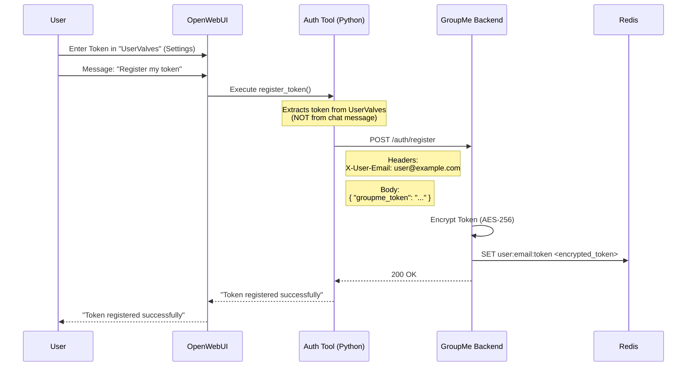
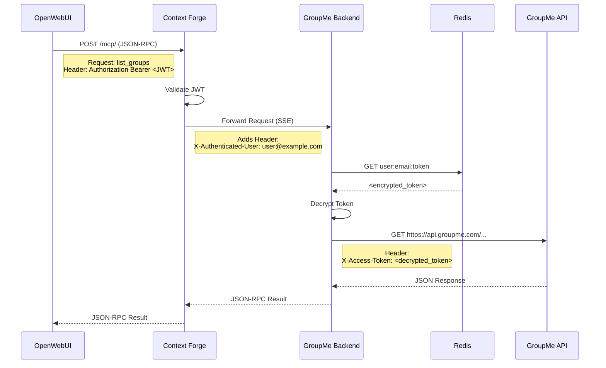

# MCP Servers

Model Context Protocol (MCP) tools for OpenWebUI integration via **Context Forge**.

## System Architecture

```mermaid
graph TD
    subgraph "K8s Cluster"
        OWUI[OpenWebUI]
        CF[Context Forge (Gateway)]
        
        subgraph "Backends"
            GM[GroupMe Backend]
            CU[ClickUp MCP]
            N8N[n8n Workflow]
        end
        
        subgraph "Storage"
            Redis[(Redis)]
            Postgres[(Postgres)]
        end
        
        OWUI --"MCP /mcp (Streamable HTTP)"--> CF
        CF --"SSE"--> GM
        CF --"SSE"--> CU
        CF --"HTTP"--> N8N
        
        GM --"Store/Read Tokens"--> Redis
        CF --"Config/Logs"--> Postgres
    end
```

## Signal Flows

### 1. User Authentication (Token Registration)

How a user's GroupMe token is securely registered without ever being exposed in chat history.



### 2. Tool Execution (MCP Request)

How OpenWebUI calls a GroupMe tool using the authenticated user's credentials.



## Component Details

| Component | Description | Port | Internal URL | Auth Type |
|-----------|-------------|------|--------------|-----------|
| **Context Forge** | Gateway/Router | 4444 | `http://context-forge.apps.svc.cluster.local:4444` | Bearer JWT |
| **GroupMe** | Backend Service | 5000 | `http://groupme-backend.apps.svc.cluster.local:5000` | Header (`X-Authenticated-User`) |
| **ClickUp** | MCP Server | 5000 | `http://clickup-mcp-server.apps.svc.cluster.local:5000` | None (Shared Key) |

## Quick Start for GroupMe Auth

1.  **Configure Token**:
    *   In OpenWebUI, go to **Workspace** -> **Tools** -> **Auth Registration**.
    *   Click the **Gear Icon** (User Settings).
    *   Paste your GroupMe Access Token in `REGISTRATION_TOKEN`.
    *   Click **Save**.

2.  **Register**:
    *   Open a new chat.
    *   Type: **"Register my GroupMe token"**.
    *   Wait for success message.

3.  **Cleanup**:
    *   Go back to **Workspace** -> **Tools** -> **Auth Registration** settings.
    *   Delete your token from `REGISTRATION_TOKEN` (it's now safely stored in the backend).

4.  **Use Tools**:
    *   "List my GroupMe groups"
    *   "Send a message to 'Family': Hello!"
